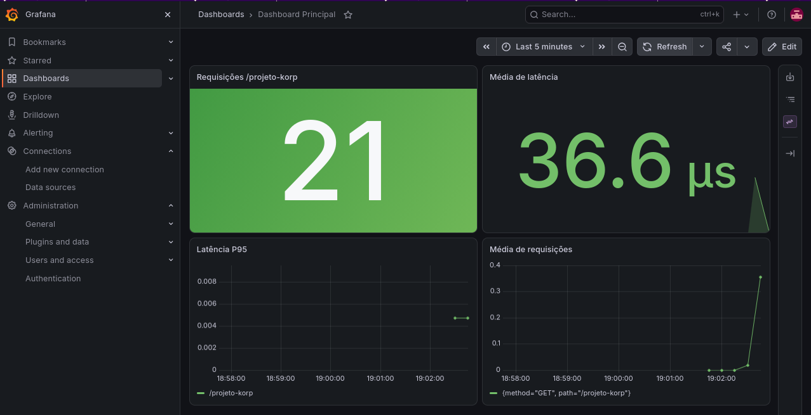

# http-server-projeto-korp

Este repositório contém a automação de implantação e monitoramento para a aplicação **Projeto Korp**, construída em Go e orquestrada via **Docker Compose** e **Ansible**.

## Parte 1
Para execução local:
```
go run httpserver.go
```

Comando para build e execução rápida:
```
sudo docker build -t http-server-projeto-korp:latest . && sudo docker compose up -d
```

## Parte 2
Grafana ativo em http://localhost:3000

Prometheus pode ser adicionado como datasource em http://prometheus:9090

http://localhost:3000/d/adqw9sx/dashboard-principal?from=2026-09-10T03:00:00.000Z&to=2026-09-10T04:59:59.000Z&timezone=browser

## Parte 3
Estarei testando o Ansible num container Fedora
```
sudo docker run -it --rm \
  -v /var/run/docker.sock:/var/run/docker.sock \
  -v $(pwd):/app \
  -w /app \
  fedora:latest bash

dnf install -y ansible git
ansible-playbook -i ansible/inventory ansible/playbook.yml
```

# Grafana
